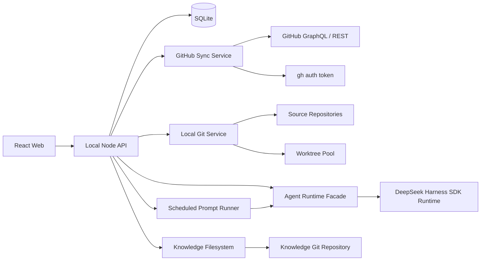
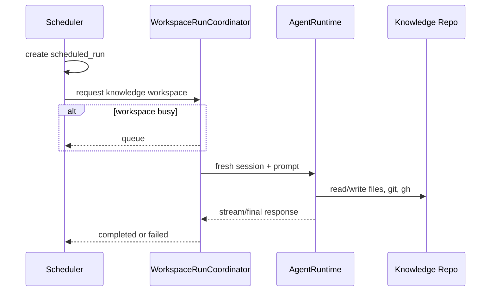

# LoongBoard V1 技术开发与多 Agent 协同执行方案

> 文档状态：Implementation Ready  
> 需求状态：已与产品所有者对齐  
> 编写日期：2026-09-02  
> 适用范围：全新重构仓库，不复用旧 LoongBoard 的实现代码  
> 主要维护方式：Codex 主 Agent + 多子 Agent 协同开发与后续维护  
> DSH 基线：`deepseek-harness@0.1.2-alpha.5`，Tag `dsh-v0.1.2-alpha.5`，Commit `db6bdc3576c2d4e7c965e8e3ed0c2a731eed87f5`

---

## 0. 本文用途与执行规则

本文是 LoongBoard V1 的产品需求基线、技术架构、实现约束、测试标准、验收标准和多 Agent 分工方案。开发团队应把本文视为 V1 的主执行蓝图。

实施过程中遵循以下规则：

1. 产品需求以本文“V1 功能范围”为准，不从旧仓库反推需求。
2. 不为了“未来可能需要”提前建设平台、权限、工作流、插件或抽象层。
3. 遇到需求与技术成本冲突时，优先保留用户真正需要的信息，删除低价值高成本字段。
4. DSH 是外部 Agent Runtime，不是 LoongBoard 的应用框架。
5. GitHub 页面请求不得直接触发 GitHub 网络调用；页面只读本地缓存。
6. Agent 可操作整个本地系统目录，不建立 LoongBoard 自己的细粒度权限系统。
7. 只在真实边界做校验，不在内部代码中重复防御。
8. 所有阶段必须由主 Agent 验收后才能进入下一阶段。
9. 子 Agent 不得自行扩大任务范围；发现架构问题时提交给主 Agent判断。
10. 实施前若 DSH 已发布更新版本，主 Agent只能先做兼容评估；不得直接把移动的 `master` 当生产依赖。

---

# 第一部分：产品需求基线

## 1. 产品定位

LoongBoard V1 是一个本地优先的仓库活动阅读、PR 代码研究、Agent 对话和 Markdown 知识沉淀工具。

它主要解决两个问题：

1. 快速看到 GitHub 仓库最近有哪些 PR 和 Issue 在活跃。
2. 在一个页面内同时获得 GitHub Changes 风格的代码阅读体验与通用 Coding Agent 对话能力。
3. 把定时 Agent 任务和日常研究结果沉淀到一个普通 Git Markdown 知识仓库。

LoongBoard V1 不是：

- 自动生成所有 PR 摘要的 AI 情报平台；
- 自动判断所有技术趋势的分析平台；
- 在线 IDE；
- 代码搜索或调用图产品；
- 多租户云服务；
- DSH 的二次开发发行版；
- 带复杂权限和审批体系的 Agent 平台。

---

## 2. V1 功能范围

### 2.1 Repository / PR 列表

每个配置仓库提供统一 PR 列表，默认按照 `last_activity_at DESC` 排序。

PR 列表显示：

- PR 编号与标题；
- 四种互斥展示状态：`Draft`、`Open`、`Closed`、`Merged`；
- 最后活跃时间；
- 修改文件数量；
- additions / deletions；
- 一个或多个领域标签；
- 作者；
- GitHub 原链接。

支持筛选：

- 状态；
- 最后活跃日期（日历）；
- 领域标签；
- 标题或 PR 编号搜索。

“合入 PR”不拆成独立页面。通过 `Merged` 状态筛选完成。

“最后活跃”直接使用 GitHub `updatedAt`。V1 不获取“最后一次活动的精确类型”，不区分最后一次是评论、提交、改标题还是 Review。

### 2.2 PR 领域分类

PR 领域分类完全基于 changed file paths，不使用 AI。

用户可以为每个仓库维护：

- 领域名称；
- 领域说明；
- 一组文件路径 glob 规则；
- 启用状态；
- 展示顺序。

一个 PR 可以同时命中多个领域。

示例：

```yaml
- name: CI
  description: CI、构建与自动化配置
  patterns:
    - ".github/**"
    - "ci/**"
    - "scripts/ci/**"

- name: Scheduler
  description: 调度器核心实现与测试
  patterns:
    - "vllm/v1/core/sched/**"
    - "tests/v1/core/sched/**"
```

不设计主领域、置信度、AI 补分类或复杂规则优先级。

### 2.3 Issue 列表与详情

Issue 默认按照 `last_activity_at DESC` 排序。

Issue 列表显示：

- Issue 编号与标题；
- `Open` / `Closed`；
- 最后活跃时间；
- 作者；
- 评论数量；
- GitHub 原链接。

支持：

- 最后活跃日期筛选；
- 状态筛选；
- 标题或编号搜索。

V1 不给 Issue 做领域分类。

Issue 详情显示：

- 标题、正文、状态、作者；
- 评论列表；
- GitHub 原链接；
- 右侧普通 Agent Chat。

Issue Chat 默认可以以仓库主分支本地目录作为 cwd，但不自动把当前 Issue 内容注入 Agent。用户直接在问题中说明 Issue 编号或内容。

### 2.4 PR Research Workspace

PR 详情页为三栏结构：

```text
┌──────────────────┬──────────────────────────────────┬──────────────────┐
│ Changed Files    │ Code Workspace                   │ Agent Chat       │
│                  │                                  │                  │
│ 文件树与统计     │ Changes / Full File              │ 通用对话         │
│                  │ Inline / Split Diff              │                  │
└──────────────────┴──────────────────────────────────┴──────────────────┘
```

核心要求：

- 左侧显示 changed files；
- 中间可查看 GitHub 风格 diff；
- 支持 Inline / Split；
- 支持 Changes 模式；
- 支持 Full File 模式；
- Full File 必须保留当前 PR 的修改标记；
- 页面右侧是持续存在的 Agent Chat；
- Agent 不自动感知当前选中代码、文件或页面 Surface Context；
- Agent 通过当前本地仓库和 commit 自行搜索；
- 不提供独立“Analyze PR”工作流；
- 不提供自动 PR 摘要；
- 可提供“复制本地 PR 命令”按钮。

### 2.5 本地 PR 命令

每个仓库配置可设置命令模板，例如：

```text
git fetch {remote} pull/{number}/head:pr-{number} && git switch pr-{number}
```

PR 页面替换占位符后复制命令，不直接控制用户的 VS Code 或主工作区。

### 2.6 Worktree Pool

每个源码仓库配置有限数量的 worktree slot。

行为：

1. 如果当前 PR 已有匹配 worktree，直接使用。
2. 如果没有，优先使用空闲 slot。
3. 再选择最久未使用且当前不运行、工作区干净的 slot。
4. slot 被重新分配给新 PR 时，为该 PR 创建新的默认聊天 Session。
5. 不切换正在运行 Agent 的 slot。
6. 不自动覆盖 dirty slot。
7. V1 不建设复杂抢占、分布式锁或跨机器调度。
8. 用户可点击按钮检查 slot 当前 HEAD 是否与 PR 目标 SHA 一致。
9. 不一致时可显式执行同步。
10. Worktree 是缓存；历史 Chat 记录不能因为 slot 被复用而删除。

### 2.7 Knowledge Repository

知识库是一个普通 Git 仓库，保存标准 Markdown 与图片。

功能：

- 文件夹树；
- 新建、移动、重命名、删除 Markdown；
- 阅读模式；
- Markdown 源码编辑；
- 保存；
- GFM 表格、代码块、链接、图片；
- Mermaid；
- 最近 10 次有内容变化的保存历史；
- 查看历史内容；
- 恢复历史版本；
- 每篇文档可绑定一个默认 Chat Session；
- 文档移动后默认 Chat 映射保持；
- Agent cwd 为整个知识仓库；
- Agent 可以访问和修改整个 `system/` 中的其他仓库；
- 不做“小贴士”；
- 不做知识图谱、RAG、自动目录整理或自动知识提取。

### 2.8 Scheduled Agent Tasks

定时任务本质是：

```text
到达时间
  → 把用户保存的 Prompt 原样发送给 Agent
  → Agent 操作整个知识仓库和系统目录
```

任务字段：

- 名称；
- Cron 表达式或可视化时间；
- 时区；
- Prompt；
- 启用状态；
- 下次运行时间；
- 上次运行状态；
- 运行历史；
- 手动 Run Now。

Prompt 自己决定：

- 新建报告；
- 更新报告；
- 写入暂存区；
- 读取其他日报；
- Git commit；
- Git push；
- 查询 GitHub；
- 对照源码仓库。

LoongBoard 不解析 Prompt 的业务含义，也不提供 DAG Workflow Builder。

### 2.9 本地 System Workspace

约定一个大的本地系统目录：

```text
system/
├── vllm/
├── vllm-ascend/
├── loong-dashboard/
├── knowledge/
├── dsh/                     # 可选 upstream checkout
├── .worktrees/
│   ├── vllm/
│   └── vllm-ascend/
├── .loong/
│   ├── data/
│   ├── dsh/
│   ├── logs/
│   └── cache/
├── system.yaml
└── AGENTS.md
```

`system/` 本身不是 Git 仓库。其子目录独立管理 Git。

仓库归属与远程维护约定（2026-09-03 明确，避免与个人开发仓混淆）：

- 目录内 `vllm/`、`vllm-ascend/` 是“被管理源码宿主”，即 LoongBoard 专用工作副本：平台只对它们执行 fetch，并把它们作为 `.worktrees/` 中 detached worktree 的宿主仓库；这些目录不做个人开发编辑。
- 个人开发使用独立 clone / fork（例如用户主目录下的个人工作仓），与被管理宿主彻底分离：worktree slot 与宿主仓库一律不得指向个人开发仓库，个人改动经 fork → PR 回流。
- `system.yaml` 只存在于本机容器根，本身不纳入任何 Git 仓库；需要分发/共享时提交脱敏模板 `system.example.yaml`。
- 远程维护采用多仓并行：`loong-dashboard/`、`knowledge/`、顶层配置与文档各自独立推送到 GitHub（默认私有）；`vllm/`、`vllm-ascend/` 等被管理宿主不纳入自有 GitHub 仓库（其上游本身就是公开源）。


---

## 3. V1 明确不做

以下功能不得在 V1 中顺手添加：

- PR 自动摘要；
- PR AI 分类；
- Issue 领域分类；
- 精确活动类型 Timeline 同步；
- 自动页面 Surface Context；
- 选中代码自动注入 Agent；
- 独立源码浏览器；
- Symbol Graph / Call Graph；
- 全仓代码搜索产品；
- Review Risk Score；
- 自动 Review 工作流；
- 多用户、账号、团队和权限；
- GitHub 写操作；
- Agent 代码级权限控制；
- LoongBoard 自定义 Agent Tool；
- DSH Plugin；
- DSH Web UI 集成；
- 知识图谱；
- 小贴士；
- 自动知识合并；
- MkDocs 插件系统；
- 云端部署；
- Webhook；
- 多机 Agent Node；
- 复杂工作流编排；
- 复杂 Worktree 抢占。

---

# 第二部分：架构原则

## 4. 核心架构原则

### P1. Local-first

V1 是单用户、本地运行应用。所有服务绑定 `127.0.0.1`，不建设登录和远程访问。

### P2. 页面读取本地状态

PR / Issue 列表和详情首先读取 SQLite 与本地 Git。HTTP 页面请求不得隐式触发完整 GitHub 同步。

### P3. 高价值字段优先

每个字段必须评估：

- 用户价值；
- 网络成本；
- 命令启动次数；
- 数据量；
- 刷新频率；
- 是否可以本地推导。

低价值、高成本字段直接舍弃。

### P4. 分层获取

```text
GitHub Summary Sync       高频、便宜
Changed Files Enrichment 条件触发、中等成本
PR Local Git Content      用户打开时按需
Agent Work                用户提问或定时任务时触发
```

### P5. DSH 外部化

只有 DSH Adapter 包可以 import `@deepseek-ai/*`。业务代码不得依赖 Cordis、DSH SessionEvent 或内部包路径。

### P6. 不写 DSH Plugin

V1 使用官方 TypeScript SDK 启动 `sdk` profile。除非 SDK 无法满足已经确认的需求，否则不编写任何 DSH Plugin、Bundle 或自定义 Agent Loop。

### P7. 普通文件优先

知识文档是真实 `.md` 文件；Git 是长期历史。SQLite 只保存索引、短期历史和 UI 映射。

### P8. Agent 保持通用

用户消息原样发送给 Agent。不自动拼接页面上下文，不用固定“分析 PR”Prompt 限制 Agent。

### P9. 必要并发，禁止无限并发

每类外部资源有明确并发预算。先判断哪些项目变化，再并发获取必要详情。

### P10. 部分成功优先

GitHub Summary 成功后立即提交；某个 PR files 获取失败不能让整个同步失败。

### P11. 不静默降级

可以显示旧缓存或 pending，但必须明确状态。不得在 DSH 失败时伪造回答，也不得吞掉异常假装成功。

### P12. 边界一次校验

系统配置、HTTP 输入、GitHub 响应、DSH 事件和文件路径在进入系统时校验一次。进入内部强类型数据后不重复检查。

---

# 第三部分：系统技术架构

## 5. 总体架构



V1 只包含两个常驻进程：

1. LoongBoard Node Server；
2. 浏览器页面。

DSH 子进程按 workspace 惰性启动，空闲后关闭。

---

## 6. 技术栈

| 层 | 选择 |
|---|---|
| Runtime | Node.js 24，满足当前 DSH `>=24` 要求 |
| Package Manager | pnpm，版本写入 `packageManager` 并锁定 |
| Language | TypeScript strict |
| Web | React + Vite |
| Router | TanStack Router |
| Server State | TanStack Query |
| Local API | Hono on Node |
| Streaming | Server-Sent Events |
| Database | SQLite WAL |
| ORM / Migration | Drizzle ORM |
| SQLite Driver | better-sqlite3 |
| GitHub | `@octokit/graphql` + `@octokit/rest` |
| GitHub Auth | `GITHUB_TOKEN` 优先，否则启动时执行一次 `gh auth token` |
| Git Process | execa，参数数组调用，不经 shell 拼接 |
| Glob | picomatch |
| Diff UI | Monaco Diff Editor |
| Markdown Editor | CodeMirror 6 |
| Markdown Preview | react-markdown + remark-gfm |
| Mermaid | mermaid |
| Filesystem Watch | chokidar |
| Scheduler | croner |
| Unit / Integration | Vitest |
| Property Test | fast-check |
| Browser E2E | Playwright |
| HTTP Mock | MSW 或本地 fixture server |
| Architecture Check | dependency-cruiser + ESLint restricted imports |

不要引入：

- Redux；
- GraphQL Server；
- tRPC；
- CQRS；
- Event Sourcing；
- Kafka / Redis；
- Docker 作为本地开发必需品；
- 微服务；
- 自定义 DI Container；
- 全局 Result Monad；
- Repository Pattern 套在每张表上。

---

## 7. 新仓库目录

```text
loong-dashboard/
├── apps/
│   ├── web/
│   │   ├── src/
│   │   ├── AGENTS.md
│   │   └── package.json
│   └── server/
│       ├── src/
│       │   ├── api/
│       │   ├── features/
│       │   ├── app.ts
│       │   └── main.ts
│       ├── AGENTS.md
│       └── package.json
├── packages/
│   ├── contracts/
│   ├── config/
│   ├── db/
│   ├── github-sync/
│   ├── git-workspaces/
│   ├── agent-runtime/
│   ├── knowledge/
│   └── scheduler/
├── docs/
│   ├── product/
│   ├── architecture/
│   ├── implementation/
│   ├── testing/
│   ├── operations/
│   └── adr/
├── tests/
│   ├── fixtures/
│   │   ├── github/
│   │   ├── git-repos/
│   │   └── knowledge/
│   ├── integration/
│   ├── e2e/
│   └── dsh-compat/
├── scripts/
├── .github/workflows/
├── AGENTS.md
├── ARCHITECTURE.md
├── README.md
├── CONTRIBUTING.md
├── package.json
├── pnpm-workspace.yaml
├── tsconfig.json
├── eslint.config.js
├── drizzle.config.ts
└── dsh.lock.json
```

### 包职责

| 包 | Owns | Does not own |
|---|---|---|
| `contracts` | HTTP DTO、SSE event、公共枚举 | DB、业务执行 |
| `config` | `system.yaml` 解析和路径解析 | GitHub、Git |
| `db` | schema、migration、typed queries | GitHub 规则、UI |
| `github-sync` | GitHub Auth、GraphQL/REST、增量同步 | 页面、Git 内容 |
| `git-workspaces` | 本地 Git、PR commit、worktree pool | DSH、UI |
| `agent-runtime` | 最小 Agent 接口、DSH Adapter、runtime lifecycle | 产品业务 |
| `knowledge` | Markdown 文件、文档 ID、历史、文件树 | Agent 推理 |
| `scheduler` | Cron、任务状态、将 Prompt 交给 Agent | 理解 Prompt |
| `apps/server` | 用例编排、API、SSE | 底层 provider 细节 |
| `apps/web` | 产品界面 | GitHub、Git、DSH 直接调用 |

---

# 第四部分：本地系统配置

## 8. `system.yaml`

```yaml
version: 1
timezone: Asia/Shanghai

repositories:
  vllm:
    path: ./vllm
    github: vllm-project/vllm
    remote: upstream
    defaultBranch: main
    worktreeSlots: 3
    checkoutCommandTemplate: >-
      git fetch {remote} pull/{number}/head:pr-{number} &&
      git switch pr-{number}

  vllm-ascend:
    path: ./vllm-ascend
    github: vllm-project/vllm-ascend
    remote: upstream
    defaultBranch: main
    worktreeSlots: 3
    checkoutCommandTemplate: >-
      git fetch {remote} pull/{number}/head:pr-{number} &&
      git switch pr-{number}

knowledge:
  path: ./knowledge
  inbox: inbox
  historyLimit: 10

githubSync:
  intervalMinutes: 5
  initialBackfillDays: 90
  fileFetchConcurrency: 4

agent:
  provider: deepseek-official
  model: deepseek-v4-flash
  reasoningEffort: high
  maxTokens: 49152
  idleShutdownMinutes: 10

server:
  host: 127.0.0.1
  port: 4174
```

规则：

- 所有相对路径相对 `system.yaml` 所在目录解析；
- 配置启动时解析一次；
- 配置错误直接阻止启动，并给出字段级错误；
- V1 不做配置热更新；
- V1 不在 UI 中编辑模型凭据；
- DSH 子进程继承 LoongBoard 进程环境；
- `system/AGENTS.md` 是 Agent 的全局行为指导。

---

# 第五部分：数据模型

## 9. SQLite 设置

启动连接：

```sql
PRAGMA journal_mode = WAL;
PRAGMA foreign_keys = ON;
PRAGMA busy_timeout = 5000;
```

时间统一保存为 UTC epoch milliseconds。页面日期筛选使用 `system.yaml.timezone` 计算本地日边界，再转换为 UTC 查询。

## 10. 表设计

### 10.1 `repositories`

| 字段 | 说明 |
|---|---|
| `key` PK | 配置 key，例如 `vllm` |
| `owner` | GitHub owner |
| `name` | GitHub repo |
| `last_pr_watermark` | 最近成功 PR 增量水位 |
| `last_issue_watermark` | 最近成功 Issue 增量水位 |
| `last_sync_at` | 最近成功 Summary Sync |
| `last_sync_error` | 最近错误摘要 |

仓库路径等静态配置以 `system.yaml` 为真源，不复制进 DB。

### 10.2 `pull_requests`

复合主键：`repository_key + number`

核心字段：

```text
github_node_id
number
title
body
url
author_login
state
is_draft
created_at
updated_at
closed_at
merged_at
base_ref_name
head_ref_name
base_sha
head_sha
additions
deletions
changed_files_count
files_head_sha
files_complete
last_synced_at
```

展示状态不单独持久化，统一函数推导：

```ts
function displayStatus(pr: PullRequest): 'draft' | 'open' | 'closed' | 'merged' {
  if (pr.isDraft) return 'draft'
  if (pr.mergedAt !== null) return 'merged'
  if (pr.state === 'CLOSED') return 'closed'
  return 'open'
}
```

### 10.3 `pull_request_files`

复合主键：`repository_key + pr_number + path`

字段：

```text
head_sha
path
previous_path
status
additions
deletions
changes
is_binary
```

当 head SHA 变化并成功获取完整新文件列表后，在一个事务中替换旧文件行。

### 10.4 `domain_rules`

```text
id
repository_key
name
description
patterns_json
enabled
sort_order
revision
created_at
updated_at
```

### 10.5 `pull_request_domains`

复合主键：`repository_key + pr_number + domain_rule_id`

```text
rule_revision
matched_path_count
computed_at
```

### 10.6 `issues`

复合主键：`repository_key + number`

```text
github_node_id
number
title
body
url
author_login
state
comments_count
created_at
updated_at
closed_at
last_synced_at
```

### 10.7 `issue_comments`

按需缓存：

```text
repository_key
issue_number
github_comment_id
author_login
body
created_at
updated_at
url
```

当 Issue `updated_at` 未变化时，不重新获取评论。

### 10.8 `worktree_slots`

```text
repository_key
slot_index
path
assigned_pr_number
expected_head_sha
actual_head_sha
is_dirty
active_run_id
last_used_at
last_checked_at
```

DB 记录是调度元数据；Git 本身是真实工作区状态。

### 10.9 `chat_sessions`

```text
id
kind                   # pr | issue | knowledge | scheduled
title
repository_key
pr_number
issue_number
document_id
workspace_key
workspace_path
expected_sha
dsh_session_id
dsh_home_path
created_at
updated_at
last_used_at
archived_at
```

### 10.10 `chat_messages`

```text
id
chat_session_id
run_id
role                   # user | assistant
content_markdown
created_at
```

只保存用户可见消息。DSH 原始事件不直接进入产品表。

### 10.11 `agent_runs`

```text
id
chat_session_id
status                 # queued | running | completed | failed | cancelled
prompt
started_at
ended_at
error_code
error_message
dsh_version
```

### 10.12 `knowledge_documents`

```text
document_id
relative_path
content_hash
default_chat_session_id
first_seen_at
last_seen_at
```

正文不存 DB。

### 10.13 `document_versions`

```text
id
document_id
content
source                 # manual | agent | restore
created_at
```

每个 document 只保留最近 `historyLimit` 条。

### 10.14 `scheduled_tasks`

```text
id
name
cron_expression
timezone
prompt
enabled
next_run_at
last_run_at
created_at
updated_at
```

### 10.15 `scheduled_runs`

```text
id
task_id
chat_session_id
status                 # queued | running | completed | failed | skipped_overlap
started_at
ended_at
error_message
```

### 10.16 `sync_runs`

```text
id
repository_key
kind                   # pr_summary | issue_summary | pr_files
status
started_at
ended_at
fetched_count
updated_count
error_message
```

只记录运行摘要，不保存冗长请求日志。

---

# 第六部分：GitHub 数据获取

## 11. Auth 策略

启动顺序：

1. 如果存在 `GITHUB_TOKEN`，使用它。
2. 否则执行一次：

```bash
gh auth token --hostname github.com
```

3. Token 只保存在进程内存，不写数据库和日志。
4. 启动时调用轻量 GitHub viewer 查询验证权限。
5. 不为每个请求启动 `gh` 子进程。
6. 所有常规同步通过 Octokit 直接发 GraphQL / REST 请求。

这样兼顾用户已有 `gh auth` 与后台性能。

---

## 12. PR Summary Sync

### 12.1 GraphQL 字段

每页最多 100 个 PR，按 `UPDATED_AT DESC`：

```graphql
query PullRequests(
  $owner: String!
  $name: String!
  $cursor: String
) {
  repository(owner: $owner, name: $name) {
    pullRequests(
      first: 100
      after: $cursor
      orderBy: { field: UPDATED_AT, direction: DESC }
    ) {
      nodes {
        id
        number
        title
        body
        url
        state
        isDraft
        createdAt
        updatedAt
        closedAt
        mergedAt
        additions
        deletions
        changedFiles
        baseRefName
        headRefName
        baseRefOid
        headRefOid
        author { login }
      }
      pageInfo {
        hasNextPage
        endCursor
      }
    }
  }
  rateLimit {
    cost
    remaining
    resetAt
  }
}
```

### 12.2 增量算法

```text
watermark = last successful PR watermark
overlap = 2 minutes

从 updatedAt 最新页开始
  → upsert 当前页
  → 收集 head SHA 变化或 files 缺失的 PR
  → 如果当前页最老 updatedAt < watermark - overlap，停止
  → 否则继续下一页

Summary 全部成功后
  → watermark = 本次开始前观察到的最大 updatedAt
```

使用复合主键幂等 upsert。失败时不推进 watermark。

### 12.3 初始同步

初始同步按 `updatedAt` 回溯 `initialBackfillDays`，默认 90 天。先完成 Summary，页面立即可用；files enrichment 在后台进行。

不要求首次启动时同步仓库全部历史 PR。

---

## 13. Issue Summary Sync

独立 GraphQL 查询，每页 100 个，按 `UPDATED_AT DESC`。

字段：

```text
id
number
title
body
url
state
createdAt
updatedAt
closedAt
comments.totalCount
author.login
```

使用独立 watermark。PR 和 Issue 查询不合并到一个复杂 GraphQL 请求，避免双 cursor 和失败耦合。

---

## 14. PR Files Enrichment

触发条件：

```text
files_head_sha IS NULL
OR files_head_sha != current head_sha
OR files_complete = false
```

REST：

```text
GET /repos/{owner}/{repo}/pulls/{number}/files?per_page=100
```

分页直到完成。

队列规则：

- 全局并发默认 4；
- 同一 PR 只允许一个 files job；
- Summary Sync 不等待 files job；
- 成功后事务替换文件列表、更新 `files_head_sha`；
- 成功后重新计算领域标签；
- 单个 PR 失败不影响其他 PR；
- 403 / rate limit 时暂停 enrichment，不阻塞 Summary；
- 404 标记一次明确错误，不无限重试；
- 5xx 或网络超时最多重试 2 次，带短指数退避。

GitHub REST 对 PR files 有最大 3000 文件限制。若触发，保存 `files_complete=false`；V1 允许领域标签不完整，并在该 PR 的标签区域显示一个轻量“文件列表不完整”状态。打开 PR 后可通过本地 Git 得到完整 diff。

---

## 15. 字段成本决策

| 字段 | 来源 | 策略 |
|---|---|---|
| 标题、状态、更新时间 | GraphQL Summary | 高频 |
| additions / deletions / changedFiles | GraphQL Summary | 高频 |
| base/head SHA | GraphQL Summary | 高频 |
| 精确最后活动类型 | Timeline | V1 舍弃 |
| changed file paths | REST files | 仅 head 变化 |
| 领域标签 | 本地规则 | files 更新后 |
| 完整 diff | 本地 Git | 打开 PR 时 |
| 完整文件 | 本地 Git | 选择文件时 |
| PR 评论 / Review Timeline | 多端点 | V1 舍弃 |
| Issue 评论 | REST comments | 打开 Issue 时 |

---

## 16. 同步并发与速率限制

### 16.1 并发预算

```text
每个仓库最多 1 个 Summary Sync
PR Summary 与 Issue Summary 可串行
Files Enrichment 全局最多 4
同一 PR files job 去重
```

### 16.2 速率感知

读取 GraphQL `rateLimit` 和 REST headers。

当余量低于配置阈值：

- 继续已有本地页面服务；
- 暂停 files enrichment；
- 延后自动 Summary；
- 允许用户手动重试；
- UI 明确显示 rate limit 状态。

不通过提高并发“抢在限制前完成”。

### 16.3 页面行为

页面 API 永远只查 SQLite。点击“刷新”是创建后台 Sync Run，不同步阻塞 HTTP 请求。

---

# 第七部分：领域分类

## 17. 分类算法

启动或规则更新时，把 patterns 编译为 matcher。

对一个 PR：

```ts
const matchedDomainIds = new Set<string>()

for (const file of changedFiles) {
  for (const rule of enabledRules) {
    if (rule.matcher(file.path)) {
      matchedDomainIds.add(rule.id)
    }
  }
}
```

规则数量和文件数量预计有限，不做复杂索引结构。

### 17.1 触发重新计算

- PR files 成功更新；
- Domain Rule 新增、编辑、启用或禁用；
- 管理页手动“重新计算”。

规则更新后的历史重算使用后台批处理，每次一个事务处理有限数量 PR，不阻塞规则保存。

### 17.2 不做的复杂度

- 不做规则优先级冲突；
- 不做 negative rules；
- 不做正则；
- 不做 AI fallback；
- 不做主领域；
- 不做置信度；
- 不把测试路径自动映射到源码领域。

---

# 第八部分：本地 Git 与 PR Workspace

## 18. Git 调用原则

所有 Git 调用集中在 `packages/git-workspaces`。

统一：

```ts
await execa('git', ['diff', ...args], { cwd })
```

禁止：

```ts
exec(`git diff ${userInput}`)
```

用户输入的 path 必须经过仓库相对路径解析和 containment 检查。

### 18.1 需要支持的 Git 操作

```text
git rev-parse
git status --porcelain=v2 --branch
git cat-file -e
git fetch
git worktree add
git worktree list --porcelain
git switch --detach
git diff --numstat --summary -M
git show <sha>:<path>
```

不建立通用 Shell 执行 API。

---

## 19. 确保 PR Commit

打开 PR 代码 Workspace 时：

```text
检查 base_sha 和 head_sha 本地是否存在
  → head 不存在：fetch refs/pull/<number>/head
  → base 不存在：fetch base branch
  → 再次验证
  → 失败则显示明确错误和 GitHub 链接
```

建议 refs：

```text
refs/loong/pull/<number>/head
```

命令示意：

```bash
git fetch --no-tags upstream \
  +refs/pull/123/head:refs/loong/pull/123/head
```

不要每次打开文件都 fetch。只有 PR Workspace ensure 或用户显式同步时执行。

---

## 20. Changed Files

本地 commits 可用后，用一次命令获取完整变化统计：

```bash
git diff --numstat --summary -M <base_sha>...<head_sha>
```

解析：

- additions / deletions；
- binary；
- create；
- delete；
- rename。

GitHub REST files 主要用于一级列表领域标签。本地 Git 是 PR Workspace 的完整事实源。

---

## 21. 文件内容

选择一个 changed file 时并行执行：

```bash
git show <base_sha>:<old_path>
git show <head_sha>:<new_path>
```

根据 status 处理：

- Added：base 为空；
- Deleted：head 为空；
- Renamed：base 使用 previous path；
- Binary：不加载文本；
- 文本超过 5 MiB：V1 不进入 Monaco，显示本地路径和 GitHub 链接。

不提前缓存所有文件内容。

---

## 22. Diff UI

使用 Monaco Diff Editor：

- `renderSideBySide=true`：Split；
- `renderSideBySide=false`：Inline；
- Changes：启用 `hideUnchangedRegions`；
- Full File：关闭 `hideUnchangedRegions`。

这使同一 original / modified 文本同时支持：

```text
只看修改区
完整文件 + 修改标记
```

不自研 diff 算法与语法高亮器。

V1 每次只渲染一个文件，左侧文件树负责切换。这样避免一次加载整个大 PR。

---

## 23. Worktree Pool

### 23.1 目录

```text
system/.worktrees/<repository-key>/slot-1
system/.worktrees/<repository-key>/slot-2
...
```

### 23.2 分配算法

```text
1. 找 assigned_pr_number 与目标 PR 一致、actual HEAD 匹配的 slot
2. 否则找相同 PR 但旧 HEAD、idle 且 clean 的 slot
3. 否则找未分配、idle 且 clean 的 slot
4. 否则找 last_used_at 最早、idle 且 clean 的 slot
5. 否则返回 WORKTREE_UNAVAILABLE
```

### 23.3 切换前最小必要检查

一次：

```bash
git status --porcelain=v2 --branch
```

获得：

- 当前 HEAD；
- 是否 dirty；
- branch / detached 状态。

必须阻止：

- 正在执行 Agent run 的 slot 被切换；
- dirty slot 被自动覆盖。

这是防止数据丢失的必要保护，不属于过度防御。

### 23.4 同步

显式点击同步：

1. 关闭该 slot 的空闲 DSH runtime；
2. fetch PR head；
3. 只在 clean / idle 时 `git switch --detach <head_sha>`；
4. 更新 slot 元数据；
5. 为新 PR 创建新的默认 Chat。

### 23.5 并发

每个 slot 一个 `WorkspaceRunCoordinator`，同一时刻只执行一个 Agent run。

V1 不支持：

- 抢占；
- 强制切换；
- 多 Agent 同时写同一个 slot；
- 自动 stash；
- 自动 commit dirty worktree。

---

## 24. 复制本地命令

命令模板从 `system.yaml` 读取。服务端只替换：

```text
{remote}
{number}
{headSha}
{baseSha}
```

UI：

- 显示最终命令；
- Copy 按钮；
- 不自动执行；
- 不尝试打开 VS Code。

---

# 第九部分：Issue

## 25. Issue 详情数据

打开 Issue 时：

1. 读取 DB 中标题、正文和状态；
2. 如果本地评论缓存对应的 Issue `updated_at` 仍有效，直接使用；
3. 否则调用 REST comments；
4. 成功后替换缓存；
5. 评论失败不影响正文显示。

不读取完整 GitHub Timeline，也不追踪正文编辑历史。

## 26. Issue Chat

创建 Chat 时：

- `kind=issue`；
- cwd 使用该仓库主 checkout；
- 不建立 worktree；
- 不切到 Issue 专属 commit；
- 不自动注入 Issue body；
- 用户自行输入“分析 Issue #123”等内容；
- 右侧提供 Issue URL 供复制。

---

# 第十部分：Agent Runtime 与 DSH 解耦

## 27. 当前 DSH 基线

实施基线锁定：

```json
{
  "package": "@deepseek-ai/dsh",
  "version": "0.1.2-alpha.5",
  "tag": "dsh-v0.1.2-alpha.5",
  "commit": "db6bdc3576c2d4e7c965e8e3ed0c2a731eed87f5"
}
```

当前 DSH TypeScript SDK 通过 stdio JSON-RPC 启动完整 `sdk` profile，提供：

- initialize；
- session/prompt；
- session.event；
- session.status；
- shutdown；
- session reuse。

当前协议没有：

- 单轮 cancel；
- session close；
- protocol version negotiation。

因此 V1 的取消语义是关闭该 workspace 的 DSH 子进程。

参考：

- [DSH v0.1.2-alpha.5 Release](https://github.com/deepseek-ai/deepseek-harness/releases/tag/dsh-v0.1.2-alpha.5)
- [DSH Architecture](https://github.com/deepseek-ai/deepseek-harness/blob/dsh-v0.1.2-alpha.5/docs/architecture.md)
- [TypeScript SDK Client](https://github.com/deepseek-ai/deepseek-harness/blob/dsh-v0.1.2-alpha.5/packages/sdk/client/README.zh.md)
- [SDK Protocol](https://github.com/deepseek-ai/deepseek-harness/blob/dsh-v0.1.2-alpha.5/packages/sdk/protocol/README.zh.md)

---

## 28. 依赖防火墙

目录：

```text
packages/agent-runtime/
├── src/
│   ├── contract.ts
│   ├── events.ts
│   ├── runtime-manager.ts
│   ├── dsh-adapter.ts
│   └── index.ts
```

只有：

```text
dsh-adapter.ts
dsh-compat/**
```

允许 import：

```text
@deepseek-ai/dsh-sdk-client
@deepseek-ai/dsh-*
```

ESLint 和 dependency-cruiser 强制：

```text
@deepseek-ai/* may only be imported from packages/agent-runtime/src/dsh-*
```

禁止 deep import：

```text
@deepseek-ai/**/src/*
```

---

## 29. Loong Agent Runtime Contract

```ts
export interface AgentRuntime {
  health(): Promise<AgentRuntimeHealth>

  ensureSession(input: {
    chatSessionId: string
    externalSessionId?: string
    workspaceKey: string
    cwd: string
  }): Promise<{
    externalSessionId: string
  }>

  run(input: {
    runId: string
    externalSessionId: string
    prompt: string
    workspaceKey: string
    cwd: string
    signal?: AbortSignal
    onEvent: (event: AgentEvent) => void
  }): Promise<{
    finalResponse: string
  }>

  stopWorkspace(workspaceKey: string): Promise<void>
  dispose(): Promise<void>
}
```

V1 不暴露：

- Tool 注册；
- Prompt injection；
- Goal；
- Workflow；
- Agent preset；
- Subagent 控制；
- DSH SessionEvent；
- Cordis context。

---

## 30. DSH Runtime Manager

### 30.1 Runtime key

一个 DSH 子进程对应一个逻辑 workspace：

```text
knowledge
repo:vllm:main
repo:vllm:slot-1
repo:vllm:slot-2
repo:vllm-ascend:slot-1
...
```

同一 workspace 的多个 Chat Session 可以复用同一个 DSH 进程，但 Agent run 串行。

### 30.2 DSH Home

```text
system/.loong/dsh/<workspace-key>/
```

每个 workspace 独立 DSH home，避免多个进程竞争同一持久化目录。

API key 等凭据从 LoongBoard 环境继承，不复制到每个 home。

### 30.3 启动

```ts
new DeepSeekHarness({
  profile: 'sdk',
  cwd: workspacePath,
  processCwd: workspacePath,
  dshHome: workspaceDshHome,
  provider: config.agent.provider,
  model: config.agent.model,
  reasoningEffort: config.agent.reasoningEffort,
  maxTokens: config.agent.maxTokens,
  env: {
    ...process.env,
    DSH_PERMISSION_MODE: 'danger-full-access',
  },
})
```

用户明确要求 Agent 可操作整个仓库与外部内容，因此使用 DSH 完整访问模式，不建设 LoongBoard 权限档案。

### 30.4 生命周期

- 第一次消息时惰性启动；
- workspace 切换 commit 前关闭；
- 空闲超过 `idleShutdownMinutes` 后关闭；
- 服务退出时统一关闭；
- DSH 启动失败直接显示错误；
- 不自动回退到其他 Agent；
- 不自动重复发送用户 Prompt。

---

## 31. Event 归一化

LoongBoard 自己定义稳定事件：

```ts
export type AgentEvent =
  | { type: 'run.started'; runId: string; at: number }
  | { type: 'status'; runId: string; status: 'running' | 'idle' }
  | { type: 'assistant.delta'; runId: string; text: string }
  | { type: 'assistant.completed'; runId: string; markdown: string }
  | { type: 'tool.started'; runId: string; toolName: string; callId: string }
  | { type: 'tool.completed'; runId: string; callId: string; isError: boolean }
  | { type: 'run.completed'; runId: string; at: number }
  | { type: 'run.failed'; runId: string; message: string; at: number }
  | { type: 'run.cancelled'; runId: string; at: number }
```

DSH 通知只在 Adapter 内解释。

V1 UI 的主要保证是：

- 用户消息立即显示；
- assistant 文本流式显示；
- 可选显示通用 Tool activity；
- 最终消息持久化；
- DSH 原始 payload 不写入产品 API。

---

## 32. Cancel

当前 DSH SDK 没有单轮取消。

V1：

```text
用户点击 Cancel
  → 关闭 workspace DSH process
  → 当前 run 标记 cancelled
  → 下一次消息重新启动 runtime
  → 相同 dsh_session_id 继续使用
```

由于 workspace run 串行，关闭进程不会取消另一个并发 run。

---

## 33. DSH Upgrade

### 33.1 精确锁定

`package.json` 禁止 `^`：

```json
{
  "dependencies": {
    "@deepseek-ai/dsh": "0.1.2-alpha.5",
    "@deepseek-ai/dsh-sdk-client": "0.1.2-alpha.5"
  }
}
```

`dsh.lock.json`：

```json
{
  "version": "0.1.2-alpha.5",
  "tag": "dsh-v0.1.2-alpha.5",
  "commit": "db6bdc3576c2d4e7c965e8e3ed0c2a731eed87f5",
  "verifiedAt": "2026-09-02"
}
```

### 33.2 升级要求

升级只允许修改：

```text
package.json / lockfile
dsh.lock.json
packages/agent-runtime/**
tests/dsh-compat/**
docs/operations/upgrade-dsh.md
```

如果升级必须修改 Repository、Knowledge 或 Web 业务代码，主 Agent应先判定为解耦回归。

### 33.3 兼容检查

- SDK compile；
- initialize；
- cwd；
- session reuse；
- stream；
- final response；
- process restart；
- full access；
- workspace file write；
- event adapter；
- cancel by process close；
- idle shutdown。

---

# 第十一部分：Knowledge Repository

## 34. 文件系统是真源

知识正文只存在于：

```text
system/knowledge/**/*.md
```

API 不复制 Markdown 正文到数据库。

忽略：

```text
.git/
node_modules/
.loong/
隐藏临时文件
```

### 34.1 Document ID

为保证移动文件后 Chat 映射不丢，文档需要稳定 ID。

使用兼容 MkDocs 的 YAML front matter：

```markdown
---
loong_id: 01J8...
---

# 文档标题
```

规则：

- App 新建文档时生成；
- 外部或 Agent 新建的 Markdown 没有 ID 也可正常显示；
- 当首次需要保存历史或绑定 Chat 时，App 添加 `loong_id`；
- Front matter 不参与正文显示；
- 移动文件时 ID 保持不变；
- 不添加其他私有 Markdown 语法。

---

## 35. 文件树

服务端读取知识仓库目录，返回：

```ts
type KnowledgeNode =
  | { kind: 'directory'; path: string; children: KnowledgeNode[] }
  | { kind: 'document'; path: string; documentId?: string; title: string }
```

所有文件操作使用知识根相对路径，并在服务端做 containment 检查。

支持：

- create directory；
- create document；
- move；
- rename；
- delete；
- refresh。

删除 V1 使用直接删除，不自建回收站；长期恢复依赖 Git。UI 必须有一次普通确认，但不做多层确认。

---

## 36. Markdown 编辑

### 36.1 编辑

CodeMirror 6：

- Markdown highlighting；
- 行号可选；
- 保存快捷键；
- 不做 WYSIWYG；
- 不做多人协作。

### 36.2 Preview

支持：

- GFM；
- table；
- task list；
- fenced code；
- image；
- link；
- blockquote；
- Mermaid。

Mermaid 只处理 `language=mermaid` 的 code fence。

相对图片通过本地 API 安全读取：

```text
/api/knowledge/assets?path=...
```

### 36.3 并发修改

读取文档时返回 `contentHash`。

保存：

```text
如果 expectedHash == 当前文件 hash
  → 保存
否则
  → 返回 DOCUMENT_CHANGED
```

UI 提供：

- 重新加载；
- 复制当前编辑内容；
- 简单 diff 查看。

不自动 merge。

这个检查用于防止用户编辑器覆盖 Agent 刚写入的内容，是必要保护。

---

## 37. 保存历史

只有内容 hash 变化才算一次保存。

保存流程：

1. 读取旧内容；
2. 若无变化直接返回；
3. 将旧内容写入 `document_versions`；
4. 写新文件；
5. 更新 hash；
6. 删除超过 limit 的最旧历史。

Agent 通过文件系统直接修改时，chokidar 发现变化：

- 更新索引；
- 记录一条 `source=agent` 的历史快照，前提是能拿到 watcher 缓存的旧内容；
- watcher 连续事件做短 debounce，避免一次编辑产生多条版本。

历史上限默认 10，可配置 5–10。

恢复历史本身形成一次新的保存，不删除原历史记录。

---

## 38. 文档 Chat 映射

```text
document_id → default_chat_session_id
```

打开文档时：

- 如果有默认 Chat，打开它；
- 如果没有，右侧显示 New Chat；
- 用户可以创建新 Chat 并设为默认；
- 用户可以切换其他 Chat；
- 这只是 UI 映射，不限制 Agent 文件访问。

不自动告诉 Agent 当前文档路径。用户需要时直接在问题中说明。

---

# 第十二部分：Scheduled Agent Tasks

## 39. Scheduler 模型

使用 `croner` 计算 `next_run_at`。

Server 启动后：

- 加载 enabled tasks；
- 注册下一次 timer；
- 执行完成后计算下一次；
- 配置变化后重新注册。

V1 假设 Server 需要在计划时间运行。服务离线期间错过的任务不自动补跑；用户可以 Run Now。

---

## 40. 执行流程



规则：

- 每次 scheduled run 使用新的 Chat Session；
- Prompt 原样发送；
- cwd 为 Knowledge Repository；
- Agent 可访问整个 system；
- 同一任务上次运行未结束时，新触发记录为 `skipped_overlap`；
- knowledge workspace 与人工 Chat 共用一个串行 coordinator；
- Run Now 走同一流程；
- Scheduler 不检查报告是否存在，也不解析输出文件。

---

# 第十三部分：API 与 SSE

## 41. HTTP API

### Repository

```text
GET    /api/repositories
POST   /api/repositories/:key/sync
GET    /api/repositories/:key/sync-runs
```

### PR

```text
GET    /api/repositories/:key/pulls
GET    /api/repositories/:key/pulls/:number
GET    /api/repositories/:key/pulls/:number/files
GET    /api/repositories/:key/pulls/:number/file?path=...
GET    /api/repositories/:key/pulls/:number/workspace
POST   /api/repositories/:key/pulls/:number/workspace/ensure
POST   /api/repositories/:key/pulls/:number/workspace/sync
GET    /api/repositories/:key/pulls/:number/checkout-command
```

PR query：

```text
state
activityDate
domain
search
cursor
limit
```

### Domain

```text
GET    /api/repositories/:key/domains
POST   /api/repositories/:key/domains
PATCH  /api/repositories/:key/domains/:id
DELETE /api/repositories/:key/domains/:id
POST   /api/repositories/:key/domains/recompute
```

### Issue

```text
GET    /api/repositories/:key/issues
GET    /api/repositories/:key/issues/:number
GET    /api/repositories/:key/issues/:number/comments
```

### Chat

```text
GET    /api/chats
POST   /api/chats
GET    /api/chats/:id
POST   /api/chats/:id/messages
POST   /api/chats/:id/cancel
GET    /api/chats/:id/events
```

### Knowledge

```text
GET    /api/knowledge/tree
POST   /api/knowledge/directories
POST   /api/knowledge/documents
GET    /api/knowledge/documents/:id
PUT    /api/knowledge/documents/:id
POST   /api/knowledge/documents/:id/move
DELETE /api/knowledge/documents/:id
GET    /api/knowledge/documents/:id/history
POST   /api/knowledge/documents/:id/history/:versionId/restore
POST   /api/knowledge/documents/:id/default-chat
```

### Schedule

```text
GET    /api/schedules
POST   /api/schedules
PATCH  /api/schedules/:id
DELETE /api/schedules/:id
POST   /api/schedules/:id/run
GET    /api/schedules/:id/runs
```

---

## 42. SSE

一个 Chat 一个事件流：

```text
GET /api/chats/:id/events?after=<event-id>
```

事件拥有单调递增本地 ID，用于浏览器重连。

SSE 只发送 Loong `AgentEvent`，不发送 DSH 原始通知。

V1 可仅在 run 期间把事件保存在内存并将完成消息写 DB；为了支持短暂刷新，可保留每个 Chat 最近 500 个 normalized event 于内存 ring buffer。服务重启后只恢复最终消息，不恢复历史 token delta。

---

# 第十四部分：并发、性能与资源

## 43. 并发协调器

### 43.1 Repository Sync Coordinator

同一仓库同一时刻最多一个 Summary Sync。重复点击刷新返回现有 run。

### 43.2 File Enrichment Queue

全局并发 4，同一 PR 去重。

### 43.3 Workspace Run Coordinator

每个 workspace 同时最多一个 Agent run，人工和定时任务进入 FIFO。

### 43.4 SQLite

- 写事务短；
- 不在事务中执行网络和 Git；
- 网络结果准备完成后再开启事务；
- 列表查询建立组合索引。

---

## 44. 关键索引

```sql
CREATE INDEX pr_activity_idx
ON pull_requests(repository_key, updated_at DESC);

CREATE INDEX pr_state_activity_idx
ON pull_requests(repository_key, state, updated_at DESC);

CREATE INDEX issue_activity_idx
ON issues(repository_key, updated_at DESC);

CREATE INDEX pr_domain_idx
ON pull_request_domains(repository_key, domain_rule_id, pr_number);

CREATE INDEX chat_updated_idx
ON chat_sessions(updated_at DESC);

CREATE INDEX scheduled_next_idx
ON scheduled_tasks(enabled, next_run_at);
```

标题搜索 V1 使用 `LIKE` 和编号精确匹配，不引入 FTS。

---

## 45. 性能目标

这些是工程预算，不是外部 SLA：

| 场景 | 目标 |
|---|---|
| 已有缓存的 PR 列表 | 本地 API p95 < 200ms |
| 日期/状态/领域筛选 | p95 < 250ms |
| 打开 Markdown 文档 | < 300ms，不含大图片 |
| 切换普通 diff 文件 | < 1s，文件 < 2MiB |
| 页面刷新 | 不触发 GitHub |
| 自动同步 | 不阻塞页面查询 |
| DSH 子进程 | 按需启动、空闲关闭 |
| Worktree 数量 | 由配置硬上限控制 |

不为了满足目标提前实现复杂缓存。先测量，再优化。

---

## 46. 需要 Benchmark 的点

实施阶段必须写可重复 benchmark：

1. `gh api` 每页启动进程 vs Octokit 长进程；
2. GraphQL Summary 单页响应体与耗时；
3. Files concurrency 2 / 4 / 8；
4. `git show` 两个并行进程的开销；
5. Monaco 1MiB、2MiB、5MiB 文件；
6. 1000、10000、50000 PR SQLite 查询；
7. Knowledge 1000 Markdown 文件的 tree scan；
8. DSH 进程启动和 idle memory。

只有 benchmark 证明瓶颈后，才允许增加 batch process、内存 cache 或更复杂索引。

---

# 第十五部分：避免过度防御性编程

## 47. 必须做的边界保护

仅以下场景必须主动校验：

- `system.yaml`；
- HTTP 用户输入；
- GitHub 响应所需字段；
- DSH 通知适配；
- 文件路径 containment；
- Git worktree dirty / active；
- Markdown optimistic hash；
- DB migration；
- Scheduled overlap；
- 外部进程退出码；
- localhost bind。

这些保护防止真实的数据损坏、命令注入或不一致。

---

## 48. 禁止的过度防御模式

### 48.1 重复 null 判断

已经通过 schema、DB `NOT NULL` 或构造函数保证的值，不在每层重复：

```ts
if (!repository) ...
if (!repository.path) ...
if (!repository.path.trim()) ...
```

### 48.2 每层重复 parse

外部 JSON 在 provider 边界 parse 一次。内部函数接收强类型对象。

### 48.3 Catch 后继续

禁止：

```ts
try {
  await sync()
} catch {
  return []
}
```

应让错误进入统一 error handler，或明确记录 partial failure。

### 48.4 静默 fallback

禁止 DSH 失败后返回模板回答、GitHub 失败后伪造空仓库。

### 48.5 提前抽象第二个实现

除明确需要 DSH 隔离的 `AgentRuntime` 外，不为“以后可能有其他 provider”提前建立 Registry/Factory。

### 48.6 通用 Result 包装

普通失败用异常和统一错误边界；预期业务状态使用小型 union：

```ts
type AllocateResult =
  | { kind: 'allocated'; slot: WorktreeSlot }
  | { kind: 'busy' }
  | { kind: 'dirty' }
```

### 48.7 过量 retry

- GitHub GET：只对 timeout / 502 / 503 重试最多 2 次；
- DSH Prompt：不自动重发；
- Git 切换：不自动 stash、reset、clean；
- DB：不循环重试逻辑错误。

### 48.8 巨大配置对象和 Builder

函数参数在清晰时直接使用普通 object；不创建十层 Builder。

### 48.9 “保险”状态复制

不同时在数据库、内存和文件中维护三个权威状态。明确真源：

| 数据 | 真源 |
|---|---|
| PR / Issue 列表 | SQLite cache |
| PR 代码 | Local Git |
| Worktree HEAD / dirty | Git |
| Worktree 分配 | SQLite |
| Markdown | Filesystem |
| 长期文档历史 | Git |
| 最近保存历史 | SQLite |
| Agent 执行 | DSH runtime |
| 用户可见 Chat | SQLite |
| 静态仓库路径 | system.yaml |

### 48.10 微小函数过度拆分

函数按一个清晰职责拆分，不把五行逻辑拆成六个 helper。抽象需要减少重复或表达领域概念。

---

## 49. 错误处理方式

服务端统一错误响应：

```ts
{
  error: {
    code: 'WORKTREE_DIRTY',
    message: 'slot-2 contains uncommitted changes and cannot be reassigned.'
  }
}
```

只定义用户可以行动的稳定错误码：

```text
CONFIG_INVALID
GITHUB_AUTH_REQUIRED
GITHUB_RATE_LIMITED
REPOSITORY_NOT_FOUND
PR_COMMIT_UNAVAILABLE
WORKTREE_DIRTY
WORKTREE_BUSY
WORKTREE_UNAVAILABLE
DOCUMENT_CHANGED
DSH_UNAVAILABLE
AGENT_RUN_FAILED
SCHEDULE_OVERLAP
```

其他意外错误记录日志并返回 `INTERNAL_ERROR`。

---

# 第十六部分：测试方案

## 50. 测试分层

```text
Unit
  → Property
  → Integration
  → Contract
  → DSH Compatibility
  → Browser E2E
```

不以单一 coverage 数字替代功能验证。

---

## 51. Unit Tests

必须覆盖：

### Repository

- PR display status；
- 时间区间与时区；
- cursor / watermark 停止；
- inclusive overlap；
- head SHA 是否触发 files；
- Summary upsert。

### Domain

- 单规则；
- 多规则；
- 多文件；
- disabled；
- revision 更新；
- 同一领域去重。

### Git Worktree

- LRU；
- same PR reuse；
- dirty 排除；
- active 排除；
- no slot；
- actual SHA compare。

### Knowledge

- front matter ID；
- move 保持 ID；
- hash 变化；
- no-op save；
- history limit；
- restore；
- path containment。

### Scheduler

- cron next run；
- disabled；
- overlap；
- manual run；
- no catch-up。

### Agent Adapter

- DSH event → Loong event；
- final assistant；
- runtime restart；
- cancel state；
- idle shutdown。

---

## 52. Property Tests

使用 fast-check：

- 日期筛选的 UTC / timezone 往返；
- 任意 changed paths 分类结果不含重复 domain；
- 编码/解码 SSE event 保持结构；
- path normalization 不越出根目录；
- history 永远不超过 limit；
- Worktree allocator 永远不选择 dirty/active slot。

---

## 53. Integration Tests

### 53.1 GitHub Sync

使用 fixture HTTP server：

- 初始 2 页 PR；
- 增量只读取到 watermark；
- comment-only updatedAt 变化但 head SHA 不变，不 fetch files；
- head SHA 变化，fetch files；
- 某个 files 请求失败，Summary 仍成功；
- rate limit 暂停 enrichment；
- Issue 独立 watermark。

### 53.2 Git

创建临时 fixture repo：

- base/head commit；
- added/modified/deleted/renamed；
- binary；
- worktree allocation；
- dirty slot；
- fetch PR ref 模拟；
- full file base/head。

### 53.3 Knowledge

临时知识仓库：

- 新建 / 移动 / 删除；
- Agent 外部修改 watcher；
- 保存历史；
- optimistic conflict；
- Mermaid 文档；
- 图片路径。

### 53.4 Scheduler

Fake Agent Runtime：

- Prompt 原样传入；
- 任务写 Markdown；
- overlap；
- failed run；
- manual run。

---

## 54. API Contract Tests

所有 API DTO 位于 `packages/contracts`。

每个路由至少有：

- success；
- invalid input；
- expected domain error；
- response shape。

SSE event schema做序列化/反序列化测试。

Web 不定义重复的手写 DTO。

---

## 55. DSH Compatibility Tests

### 55.1 每个 PR 运行

使用 fake JSON-RPC runtime 测试：

- initialize frame；
- prompt frame；
- session event；
- status idle；
- malformed event；
- process exit；
- shutdown；
- Adapter 映射。

### 55.2 Release 前运行真实 DSH

需要有效模型凭据：

1. 启动 pinned DSH；
2. cwd 指向临时 repo；
3. Prompt 读取一个文件；
4. Prompt 修改一个文件；
5. 恢复相同 session；
6. 关闭并重启 runtime；
7. 再次恢复；
8. 检查 stream；
9. 检查 full access 可读 sibling directory；
10. Cancel 关闭 runtime 后可重新启动。

真实测试默认使用 `deepseek-v4-flash`，避免把高成本模型用于例行兼容测试。

---

## 56. Browser E2E

Playwright 关键场景：

### E2E-01 PR 列表

```text
加载 fixture DB
→ 默认按最后活跃排序
→ 选择日期
→ 选择 Merged
→ 选择领域
→ 结果正确
```

### E2E-02 Domain Rules

```text
创建 CI 规则
→ files enrichment
→ PR 显示 CI
→ 修改规则
→ recompute
```

### E2E-03 PR Workspace

```text
打开 PR
→ Changed Files
→ Inline Changes
→ Split
→ Full File
→ 修改标记仍存在
```

### E2E-04 Worktree Chat

```text
ensure workspace
→ 状态匹配
→ 创建 Chat
→ Fake Agent 流式回答
→ 刷新后最终消息仍在
```

### E2E-05 Issue

```text
按最后活跃查看
→ 打开正文
→ 按需加载评论
→ 创建普通 Chat
```

### E2E-06 Knowledge

```text
新建文档
→ 编辑 Markdown
→ Preview Mermaid
→ 保存
→ 历史
→ 恢复
→ 移动
→ 默认 Chat 保持
```

### E2E-07 Schedule

```text
创建任务
→ Run Now
→ Fake Agent 在 inbox 写报告
→ run completed
→ 文档树更新
```

---

## 57. 统一验证命令

根 package scripts：

```json
{
  "scripts": {
    "dev": "...",
    "build": "...",
    "format": "...",
    "lint": "...",
    "typecheck": "...",
    "test": "vitest run",
    "test:integration": "...",
    "test:e2e": "playwright test",
    "test:dsh:compat": "...",
    "check:architecture": "...",
    "check:generated": "...",
    "check": "...",
    "check:full": "..."
  }
}
```

`pnpm check` 必须包含：

```text
format check
lint
typecheck
architecture
migration
unit
property
integration
build
```

`pnpm check:full` 再加：

```text
E2E
真实 DSH smoke（有凭据时）
```

每个错误信息应包含修复命令。

---

# 第十七部分：功能验收

## 58. Repository 验收

- 页面不调用 GitHub；
- PR 默认最后活跃排序；
- 日历按配置时区；
- 四状态互斥；
- Merged 可筛选；
- 领域多选；
- 领域完全来自 files path；
- Issue 无领域；
- Summary 即使 files 失败也能更新；
- head 不变时不重复 files 请求。

## 59. PR Workspace 验收

- base/head SHA 可验证；
- local Git diff 完整；
- Added / Deleted / Renamed 正确；
- Inline / Split；
- Changes / Full File；
- Full File 不丢修改标记；
- Worktree 有限；
- active/dirty 不被覆盖；
- Copy command 正确；
- Chat 不自动注入 Surface Context。

## 60. Agent 验收

- DSH import 不泄漏；
- Prompt 原样发送；
- cwd 正确；
- full access；
- stream；
- final message 保存；
- runtime 空闲关闭；
- cancel 可用；
- DSH 失败明确显示；
- 不自动 fallback。

## 61. Knowledge 验收

- Markdown 是真实文件；
- 可用 VS Code 编辑；
- App 可预览；
- Mermaid；
- 文档 ID 移动不变；
- 历史最多 10；
- Agent 修改也产生近期历史；
- hash 冲突不覆盖；
- 默认 Chat 只是映射。

## 62. Scheduler 验收

- Cron 正确；
- 时区正确；
- Prompt 原样发送；
- fresh session；
- 整个 Knowledge Repo cwd；
- Run Now；
- overlap skip；
- 服务离线不补跑；
- 任务结果不要求固定格式。

---

# 第十八部分：开发阶段

## 63. 阶段 0：仓库宪法与骨架

交付：

- monorepo；
- root `AGENTS.md`；
- scoped `AGENTS.md`；
- docs；
- TypeScript / lint / format；
- architecture check；
- CI；
- `system.yaml` parser；
- SQLite migration framework；
- fake providers。

验收：

```bash
pnpm check
```

空产品可启动。

---

## 64. 阶段 1：Database、Config、Local API Shell

交付：

- DB schema；
- migrations；
- Hono server；
- React shell；
- contracts；
- health API；
- repository config loading；
- SQLite WAL。

先不做 GitHub 和 DSH。

---

## 65. 阶段 2：GitHub Summary 与列表

交付：

- auth；
- PR GraphQL sync；
- Issue GraphQL sync；
- watermarks；
- sync status；
- PR list；
- Issue list；
- 日期与状态筛选；
- initial backfill；
- fixture integration tests。

---

## 66. 阶段 3：Files 与 Domain Rules

交付：

- REST files queue；
- head SHA invalidation；
- domain CRUD；
- classifier；
- recompute；
- PR 多标签；
- failure partial success。

---

## 67. 阶段 4：Local Git 与 PR Diff

交付：

- git runner；
- ensure commits；
- local changed files；
- base/head content；
- Monaco Diff；
- Inline / Split；
- Changes / Full File；
- copy command；
- Git fixture tests。

---

## 68. 阶段 5：Worktree Pool 与 Agent Chat

交付：

- slot manager；
- LRU；
- dirty/active guard；
- check/sync；
- AgentRuntime contract；
- DSH Adapter；
- Chat API；
- SSE；
- PR Chat；
- Issue Chat；
- fake runtime tests；
- DSH compatibility tests。

这是高风险集成阶段，必须由技术专家复审。

---

## 69. 阶段 6：Knowledge

交付：

- tree；
- Markdown edit/preview；
- Mermaid；
- document ID；
- history；
- restore；
- move；
- watcher；
- document default Chat；
- Knowledge Agent。

---

## 70. 阶段 7：Scheduler

交付：

- task CRUD；
- Cron；
- Run Now；
- fresh session；
- run history；
- knowledge workspace coordinator；
- overlap；
- end-to-end report generation。

---

## 71. 阶段 8：集成、性能与发布

交付：

- 完整 E2E；
- benchmark；
- 错误 UX；
- migration from empty；
- docs；
- DSH live smoke；
- production build；
- startup scripts；
- release checklist。

不包括旧 LoongBoard 数据迁移。

---

# 第十九部分：多 Agent 团队组织

## 72. 模型与角色

以下分工按用户提供的可用模型配置定义，不依赖固定公开基准。

### 72.1 主 Agent：Sol High

职责：

- 读取并维护总体计划；
- 分解任务；
- 确认子 Agent 边界；
- 控制并发任务数量；
- 解决需求冲突；
- 集成代码；
- 运行阶段验收；
- 最终架构与质量负责；
- 不把日常重复实现全部亲自完成。

### 72.2 技术专家：Sol xhigh / 极高

仅在以下情况调用：

- DSH SDK 兼容问题；
- Git worktree 数据安全；
- GitHub GraphQL / rate limit 设计；
- 并发和状态一致性；
- 难以复现的集成故障；
- 阶段 5 最终评审；
- 发布前架构审计。

专家输出应是决策、根因或补丁，不长期担任普通 worker。

### 72.3 高级实现 Agent：Luna Max

负责边界清晰但技术复杂的子系统：

- GitHub incremental sync；
- local Git / worktree；
- DSH Adapter；
- Knowledge history / watcher；
- Scheduler coordinator；
- API integration。

### 72.4 实现与 Review Agent：Luna High

负责：

- React feature；
- API routes；
- DB query；
- integration test；
- code review；
- docs 同步；
- 中等规模重构。

### 72.5 常用 Worker：DeepSeek V4 Flash

作为默认高频 Agent，处理：

- 明确的小功能；
- fixture；
- UT；
- 文档；
- CSS；
- CRUD；
- schema；
- 简单 bug；
- 重复性迁移；
- benchmark harness。

复杂决策必须回交主 Agent，不自行改变架构。

---

## 73. 并发规则

同一时刻建议最多 4 个实现子任务。

每个任务必须满足：

- 文件路径边界明确；
- 不同时修改同一核心文件；
- 有独立验收命令；
- 有明确输入和输出；
- 不依赖未合并的隐式改动。

典型并行：

```text
A: GitHub sync
B: Web list UI
C: Git fixture and git runner
D: Knowledge editor shell
```

禁止同时：

```text
两个 Agent 都修改 db/schema.ts
两个 Agent 都修改 server/app.ts
两个 Agent 都重构 contracts
```

共享文件由主 Agent或指定 Integrator 修改。

---

## 74. 子 Agent Task Packet 模板

每次委派必须包含：

```markdown
# Task

## Objective
一句话目标。

## In scope
允许实现的内容。

## Out of scope
明确禁止扩展。

## Owned paths
可修改目录。

## Dependencies
依赖的接口或 commit。

## Required behavior
用户可观察行为。

## Tests
必须增加哪些测试。

## Validation
必须运行的命令。

## Deliverable
commit、摘要、风险和未解决问题。
```

没有 Task Packet 不启动子 Agent。

---

## 75. 子 Agent 完成报告

必须返回：

```text
1. 修改内容
2. 关键设计选择
3. 测试与命令结果
4. 文件列表
5. 已知限制
6. 是否偏离 Task Packet
7. 建议主 Agent重点检查的位置
```

不得只说“已完成”。

---

## 76. 主 Agent 验收

主 Agent 对每个任务执行：

1. 阅读 diff；
2. 检查是否越界；
3. 检查是否增加无需求抽象；
4. 检查错误处理是否过度；
5. 运行指定测试；
6. 运行相邻模块测试；
7. 更新任务状态；
8. 只在验收后合并。

高风险任务要求独立 Review Agent 或 Sol xhigh 二次审查。

---

## 77. 开发分支与 Worktree

多 Agent 开发也使用 Git worktree：

```text
.loong-dev-worktrees/
├── task-001-github-sync/
├── task-002-pr-ui/
├── task-003-git-service/
└── task-004-knowledge/
```

规则：

- 一个 task 一个 branch；
- 小而完整的 commit；
- 子 Agent 不直接 merge main；
- 主 Agent rebase / merge；
- 集成冲突由主 Agent解决；
- 不允许子 Agent为解决冲突大范围重写他人代码。

---

# 第二十部分：任务分配建议

## 78. 阶段 0–1

| Task | 负责人 | Worker |
|---|---|---|
| 架构与 contracts | Sol High | Luna High |
| Repo skeleton / CI | Luna Max | V4 Flash |
| Config | Luna High | V4 Flash |
| DB schema / migrations | Luna Max | V4 Flash tests |
| Web / Server shell | Luna High | V4 Flash |

Sol xhigh 做一次架构审阅。

## 79. 阶段 2–3

| Task | 负责人 | Worker |
|---|---|---|
| GitHub Auth / Client | Luna Max | V4 Flash |
| PR incremental sync | Luna Max | V4 Flash fixtures |
| Issue incremental sync | Luna High | V4 Flash |
| Files queue | Luna Max | Luna High review |
| Domain rules | Luna High | V4 Flash |
| Repository UI | Luna High | V4 Flash CSS/tests |

## 80. 阶段 4–5

| Task | 负责人 | Worker |
|---|---|---|
| Git command layer | Luna Max | V4 Flash fixtures |
| Commit ensure / diff | Luna Max | Luna High review |
| Monaco UI | Luna High | V4 Flash |
| Worktree allocator | Luna Max | V4 Flash property tests |
| DSH Adapter | Luna Max | Sol xhigh review |
| Chat / SSE | Luna High | V4 Flash |
| DSH compat suite | Sol xhigh design | Luna Max implementation |

## 81. 阶段 6–7

| Task | 负责人 | Worker |
|---|---|---|
| Knowledge FS | Luna Max | V4 Flash tests |
| Markdown UI | Luna High | V4 Flash |
| History / ID | Luna Max | Luna High review |
| File watcher | Luna High | V4 Flash |
| Scheduler | Luna Max | V4 Flash |
| Scheduled UI | Luna High | V4 Flash |
| Knowledge Chat mapping | Luna High | V4 Flash |

## 82. 阶段 8

| Task | 负责人 |
|---|---|
| E2E 集成 | Luna Max + Luna High |
| Benchmark | V4 Flash，Luna Max审阅 |
| DSH live smoke | Sol xhigh |
| 架构审计 | Sol High + Sol xhigh |
| 最终验收 | Sol High |

---

# 第二十一部分：Agent 可维护仓库要求

## 83. 根 `AGENTS.md`

必须包含：

- 产品范围；
- 架构依赖方向；
- DSH import 规则；
- 外部边界校验规则；
- 禁止过度防御规则；
- 测试命令；
- Definition of Done；
- 不得从旧代码复制架构；
- 文档更新要求。

## 84. Scoped `AGENTS.md`

至少：

```text
apps/web/AGENTS.md
apps/server/AGENTS.md
packages/github-sync/AGENTS.md
packages/git-workspaces/AGENTS.md
packages/agent-runtime/AGENTS.md
packages/knowledge/AGENTS.md
packages/scheduler/AGENTS.md
tests/AGENTS.md
```

每份说明：

```text
Owns
Does not own
Allowed dependencies
Forbidden dependencies
Common tasks
Required tests
```

## 85. 必备文档

```text
README.md
ARCHITECTURE.md
docs/product/v1-requirements.md
docs/architecture/system.md
docs/architecture/dependencies.md
docs/implementation/github-sync.md
docs/implementation/git-worktrees.md
docs/implementation/dsh-adapter.md
docs/implementation/knowledge.md
docs/implementation/scheduler.md
docs/testing/strategy.md
docs/operations/upgrade-dsh.md
docs/operations/recovery.md
docs/adr/
```

首批 ADR：

```text
0001-local-first-single-user.md
0002-sqlite-and-filesystem.md
0003-dsh-external-sdk-boundary.md
0004-github-staged-sync.md
0005-local-git-for-pr-content.md
0006-finite-worktree-pool.md
0007-markdown-files-as-knowledge-source.md
0008-boundary-only-validation.md
```

---

# 第二十二部分：Definition of Done

## 86. 单任务 DoD

- 功能符合 Task Packet；
- 没有额外产品功能；
- public contract 已更新；
- 必要 UT / integration test；
- 无无效防御；
- 无静默 catch；
- 无 DSH 类型泄漏；
- 无 shell interpolation；
- docs 已更新；
- 指定命令通过；
- commit 可独立回滚。

## 87. 阶段 DoD

- 阶段验收场景全部通过；
- `pnpm check`；
- 主 Agent完成 code review；
- 高风险阶段完成专家 review；
- 无阻断 TODO；
- 下一阶段依赖接口冻结；
- 文档与代码一致。

## 88. V1 发布 DoD

- 空目录安装与启动；
- 两个仓库 Summary Sync；
- PR / Issue 列表；
- Domain；
- PR local diff；
- Worktree Chat；
- Issue Chat；
- Knowledge；
- Scheduler；
- DSH live smoke；
- E2E；
- 备份说明；
- DSH upgrade 说明；
- 所有 V1 非目标未被偷偷加入。

---

# 第二十三部分：运行与恢复

## 89. 数据位置

```text
system/.loong/data/loongboard.sqlite
system/.loong/logs/
system/.loong/dsh/
system/.worktrees/
system/knowledge/
```

### 89.1 可删除缓存

```text
.worktrees/
.loong/cache/
```

### 89.2 不应随意删除

```text
.loong/data/loongboard.sqlite
.loong/dsh/
knowledge/
```

## 90. 备份

V1 提供一条脚本：

```bash
pnpm backup --output <dir>
```

备份：

- SQLite consistent copy；
- `system.yaml`；
- Knowledge Git 状态摘要；
- 不复制源码仓库；
- 不复制 worktree cache。

长期知识本身通过 Git push 备份。

---

# 第二十四部分：风险与处理

## 91. DSH 快速变化

处理：

- exact pin；
- Adapter 防火墙；
- fake protocol tests；
- real smoke；
- upgrade PR；
- 不用 master 作为生产依赖。

## 92. GitHub Rate Limit

处理：

- Summary / files 分离；
- watermarks；
- head SHA cache；
- bounded concurrency；
- rate-aware pause；
- 页面只读本地 DB。

## 93. Dirty Worktree

处理：

- 不自动覆盖；
- 明确提示；
- 用户或 Agent自行 commit / cleanup；
- 不自动 stash。

## 94. Agent 全权限

这是产品选择，不是缺陷。

最小安全边界：

- 服务只绑定 localhost；
- 不开放任意 shell HTTP endpoint；
- Agent 行为由 system / repo `AGENTS.md` 指导；
- Git 负责恢复；
- 定期 commit / push 可由用户配置的 Scheduled Prompt 完成。

## 95. Markdown 同时修改

使用 content hash 防止 App 保存覆盖 Agent 修改。不做自动 merge。

## 96. 服务离线导致定时任务错过

V1 不补跑；UI 显示 missed/last run，用户 Run Now。后续根据真实需求再加入 catch-up policy。

---

# 第二十五部分：后续候选，不属于 V1

只有 V1 稳定使用后才能评估：

- MkDocs 插件；
- 文档术语小贴士；
- PR 快捷 Prompt；
- Issue 领域分类；
- 精确活动事件；
- PR 评论与 Review Timeline；
- 自动日报模板；
- 多模型 UI；
- Agent Surface Context；
- 知识搜索；
- RAG；
- GitHub 写操作；
- 自动 commit/push 的确定性实现；
- 多机 Agent；
- 云服务；
- 团队协作；
- DSH Plugin。

---

# 附录 A：根 AGENTS.md 建议内容

```markdown
# LoongBoard Repository Instructions

## Product scope

Implement only the approved V1 requirements in
`docs/product/v1-requirements.md`.

Do not infer requirements from the old LoongBoard repository.

## Architecture invariants

- Only `packages/agent-runtime/src/dsh-*` may import `@deepseek-ai/*`.
- Web and API handlers never call GitHub directly.
- GitHub summary, file enrichment, local Git, and Agent work are separate paths.
- Markdown files are the source of truth for knowledge content.
- Git is the source of long-term document history.
- PR domains are derived only from changed file path rules.
- Issue domains are not implemented in V1.
- No automatic Surface Context is injected into Agent messages.
- No LoongBoard-specific Agent permissions are implemented.

## Defensive programming

Validate external boundaries once. Trust internal types afterward.

Do not add:
- repeated null checks,
- silent catch-and-continue,
- speculative fallbacks,
- generic registries for one implementation,
- automatic retries of Agent prompts,
- automatic stash/reset/clean,
- unused future abstractions.

## Before coding

1. Read the nearest `AGENTS.md`.
2. Read the relevant requirement and implementation document.
3. Locate the source of truth.
4. Reuse an existing seam before adding a new abstraction.
5. Keep the task within its assigned paths.

## Before finishing

Run the task validation command and report:
- changed files,
- tests,
- known limitations,
- any deviation from the task packet.
```

---

# 附录 B：最小 DSH Adapter 伪代码

```ts
export class DshAgentRuntime implements AgentRuntime {
  private readonly workspaces = new Map<string, WorkspaceRuntime>()

  async run(input: AgentRunInput): Promise<AgentRunResult> {
    const runtime = await this.getOrStart(input.workspaceKey, input.cwd)

    return runtime.coordinator.runExclusive(async () => {
      const session = runtime.harness.session(input.externalSessionId)

      const result = await session.run(input.prompt, {
        onNotification: notification => {
          const event = mapDshNotification(input.runId, notification)
          if (event) input.onEvent(event)
        },
      })

      return { finalResponse: result.finalResponse }
    })
  }

  async stopWorkspace(workspaceKey: string): Promise<void> {
    const runtime = this.workspaces.get(workspaceKey)
    if (!runtime) return

    this.workspaces.delete(workspaceKey)
    await runtime.harness.close()
  }
}
```

不要把此伪代码扩展成框架。实现只补充：

- startup；
- idle timer；
- process error；
- event mapping；
- workspace serialization。

---

# 附录 C：开发启动清单

主 Agent 开始实施时：

```text
[ ] 建立全新仓库
[ ] 写 root AGENTS.md
[ ] 复制本文到 docs/product-and-technical-plan.md
[ ] 建立 ADR
[ ] 锁 Node / pnpm
[ ] 锁 DSH 0.1.2-alpha.5
[ ] 建 system.yaml schema
[ ] 建 fake GitHub provider
[ ] 建 fake AgentRuntime
[ ] 建 SQLite migrations
[ ] 建 pnpm check
[ ] 阶段 0 验收
```

---

# 附录 D：上游事实与设计依据

截至 2026-09-02：

- DSH 最新 Release 是 `v0.1.2-alpha.5`；
- Tag 指向 `db6bdc3576c2d4e7c965e8e3ed0c2a731eed87f5`；
- 当前 SDK 以子进程启动 `sdk` profile；
- SDK 初始化固定 cwd、provider、model 和 reasoning effort；
- SDK 通过 `session.event` / `session.status` 通知；
- 当前协议没有取消和版本协商；
- DSH `0.1.2-alpha.4` 已发生 `Session.events` API 替换等兼容性变化，因此业务代码不得依赖 DSH 内部 Session API。

GitHub 侧：

- `gh api graphql` 支持 GraphQL 与分页；
- GraphQL connection 每页上限 100；
- PR files REST endpoint 支持分页，最多返回 3000 个文件；
- GitHub 有 primary 和 secondary rate limit；
- 高并发可能触发 secondary limits，因此本方案使用 staged sync 与 bounded concurrency。

参考资料：

- [GitHub CLI gh api](https://cli.github.com/manual/gh_api)
- [GitHub GraphQL rate limits](https://docs.github.com/zh/graphql/overview/rate-limits-and-query-limits-for-the-graphql-api)
- [GitHub REST rate limits](https://docs.github.com/en/rest/using-the-rest-api/rate-limits-for-the-rest-api)
- [GitHub Pull Request REST API](https://docs.github.com/en/rest/pulls/pulls)
- [DeepSeek Harness Release](https://github.com/deepseek-ai/deepseek-harness/releases/tag/dsh-v0.1.2-alpha.5)
- [DeepSeek Harness SDK Client](https://github.com/deepseek-ai/deepseek-harness/blob/dsh-v0.1.2-alpha.5/packages/sdk/client/README.zh.md)
- [DeepSeek Harness SDK Protocol](https://github.com/deepseek-ai/deepseek-harness/blob/dsh-v0.1.2-alpha.5/packages/sdk/protocol/README.zh.md)
